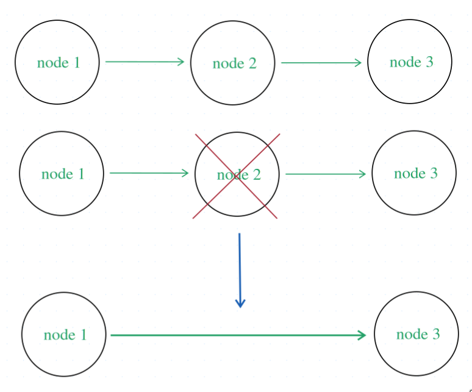

# leetcode 19 題講解

> leetcode 第19題網址: https://leetcode.com/problems/remove-nth-node-from-end-of-list/description/

這題的需求要我們實現一個函數來刪除 Singly Linked List 倒數 n 位置的節點

### 解題思路:
1. 怎麼刪除特定位置的節點

    先不管怎麼找到倒數 n 位置的方法, 只管如何刪除一個特定位置的節點

    這個所謂的特定位置可以是你自己定義的

    特定位置可以考慮選撰一些不是鏈表邊界的位置 (開始與結束位置) , 如鏈表中間的節點開始想, 因為這些位置代表着普通情況

    

    其實這裡有很多種做法, 不過我這邊我只提兩個有代表性的, 這裡其實有兩種兩種做法, 一種是效率較低的做法, 但合符人的直覺思維, 另一個是符合鏈表結構的做法, 效率是最好的, 而且容易實現

    1. 合符人的直覺思維的做法

        首先先想一下日常生活中, 有甚麼場景是有一連串的數據, 而你需要去刪除其中的某些數據, 而我想到的是在寫一句句子的時侯, 可能是在作文的時侯, 我們有時侯回頭發現某些句子中有一些字寫多了一次, 或者一些詞想要刪掉, 你而要去刪了這個多出來的字或詞, 而此時的你直覺上就是找到要刪的字或詞拿改錯帶直接覆盖掉, 而接下來所講的做法就是符合這種直覺的做法

        首先到達節點的位置, 直接刪除該節點

        ```c
        unsigned int n = 2; // node 2 的位置

        struct ListNode *p = head; /* p 是存 node 2 地址訊息的指針
                                    * head 是鏈表頭
                                    */ 
        struct ListNode *last_node; // last_node 是記錄 node 2 的上一個 node 地址訊息的指針, 關於它的使用, 等等會提及

        // p 由鏈表頭的位置開始前進到 node 2 位置並存下 node 2 的地址訊息
        // last_node 一直記錄 p 前一步, 實現記錄 node 2 的前一個 node 的地址訊息
        for (int i = 1; i < n; i++) {
            last_node = p;
            p = p->next;
        }

        /* 現在free刪除節點?, 釋放掉 node 2 的空間, 只是屬於內存層的刪除
         * 我們還需要解決數據結構(鏈表)層的刪除, 如果我們現在free刪除節點會使鏈表斷鏈 (node 1 的next指向了一個不屬於該程序的內存位置)
         * 而且會做成內存洩漏 (原先是靠 node 2 的next存取 node 3, 現在 node 2 沒法訪問, 導致 node 3 的訊息丟失)
         * 所以現在我們要解決的問題就是要先把數據結構(鏈表)層的刪除先做好
         */
        // free(p);

        /* 數據結構(鏈表)層的刪除
         * 這裡就是會用到last_node這個變量
         * 目的是想記錄 node 2 的前一個 node 的地址訊息即 node 1, 然後把 node 1 指向 node 3, 這樣就實現了鏈表這個數據結構的刪除操作
         */
        last_node->next = p->next; // node 3 的節點的地址訊息

        // 內存層的刪除
        free(p);

        // 以上就是普通情況下所需要顧及的情況
        ```

    2. 符合鏈表結構的做法

        我們仔細分析鏈表的每個節點所帶給我們的訊息還有鏈表結構的特性

        每個節點帶給我們的訊息:

            1. 當前節點所存的數據 Node.val
            2. 下個節點的地址訊息 Node.next
        
        鏈表結構的特性: 是線性的

        再回頭想想要做到內存層面的刪除還有數據結構(鏈表)層面的刪除需要甚麼:

        - 內存層面的刪除需要我們要刪的那個節點(node 2)的地址訊息
        - 數據結構(鏈表)層面的刪除需要刪的那個節點(node 2)的前一個節點(node 1)的地址訊息和要刪的那個節點(node 2)後的節點(node 3)的地址訊息

        總結就是我們需要 node 1, node 2, node 3 的地址訊息, 而鏈表是線性的, 我們只要得出 node 1 的地址訊息就可以得出 node 2 node 3 的地址訊息了

        所以最佳做法應該是有一個指針指向要刪的那個節點(node 2)的前一個節點(node 1)
        ```c
        unsigned int n = 2; // node 2 的位置

        struct ListNode *p = head; /* p 是存 node 1 地址訊息的指針
                                    * head 是鏈表頭
                                    */ 

        // p 由鏈表頭的位置開始前進到 node 2 前一個節點的位置並存下該節點地址訊息
        for (int i = 1; i < n - 1; i++) {
            p = p->next;
        }

        // 記錄 node 2 的地址訊息, 為了等一下的 free 操作
        struct ListNode *remove_node = p->next;

        p->next = p->next->next;

        free(remove_node);
        ```

        該做法相比前面的做法, 減少了在for語句中的操作, 原因是前面的做法沒有考慮到鏈表的特性:線性, 前面的做法 p 到達 node 2 後因為單鏈表的結構, 無法取得前面的節點, 需提前開一個指針指向 node 2 的前一個節點, 並需要跟着 p 移動

總結:  
每前想要刪除特定位置的節點, 只需要有一個指針指向特定位置節點的前一個節點
例如想刪除 node 2, 就有一個指針需要指向 node 1
> 現在試想想該方法在刪除哪個位置的節點會有問題

2. 邊界問題

    在看完第一個問題的總結後, 應該不難發現如果我們想刪除第一個位置的節點其實會比較棘手, 因為第一個節點的前面沒有節點, 此時就要使用到有頭鏈表的技巧, 剛好解決掉第一個節點前沒有節點的問題, 而且方便函數返回鏈表頭, 詳細請看

3. 如何找到倒數第 n 位的節點

    如何找到一件物品

