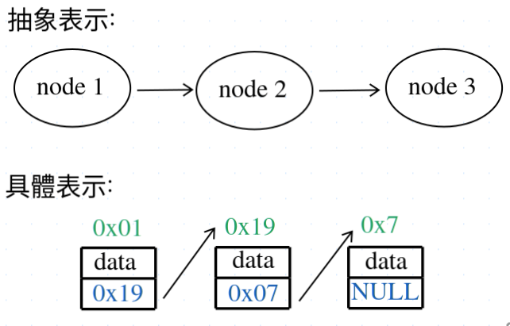
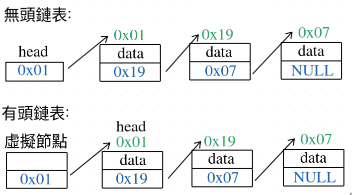

# 鏈表 (Linked List)

鏈表是一種由一連串的[節點](#節點-node)互相串連形成的線性表, 這裡指的線性是指邏輯上的, 並非指物理上, 即在內存中的位置並不一定是連續的

以下是鏈表的示意圖:  
  
<font color="#00ff80">綠色字</font>為每個節點在內存中儲存的位置  
<font color="#00ffff">藍色字</font>為每個節點在中儲存的下一個節點內存位置  
鏈表在具體實現下通常情況下都是以 <font color="#00ffff">NULL (空指針)</font> 表示這個節點沒指向節點, 換句話說這個節點是鏈表的尾節點

從示意圖可見具體實現下節點是以指針的方式串聯起來的

## 節點 (node)

節點由所儲存的訊息加上指向下個節點的指針形成, 以下是簡單範例:
```c
struct node {
    int data; // 儲存的訊息, 具體情況下可根據具體需求改變數據訊息類型, 這裡的數據訊息類型是int
    struct node *next; // 指向下一個節點的指針
};
```

## 鏈表的編碼技巧-無頭鏈表與有頭鏈表

無頭鏈表是一般情況  
有頭鏈表是編碼上的技巧

關於**無頭鏈表**和**有頭鏈表**的英文, 我在網上找不到相關術語的英文, 不知道是不是只有內地會這樣叫, 這兩個術語是我在內地的文章看到的



**無頭鏈表**定義  
鏈表的head不包括存儲的訊息, 是一個只存鏈表頭節點地址的指針

> 地址是內存物理位置的標識, 而指針是地址的容器, 即指針是保存內存物理位置訊息的變量

**有頭鏈表**定義  
鏈表的head本身已經是一個[節點](#節點-node), 但我們不會使用這個節點來存儲東西, 這種頭節點也叫虛擬節點 Dummy node, **有頭鏈表**的存在意義是為了方便程序的內部實現, 使代碼不會因為邊界問題而過於冗長, 導致難以維護, 以下會分別用**無頭鏈表**與**有頭鏈表**的插入操作代碼進行相比較 (為了方便演示, 以下代碼已刪減錯誤檢查的相關代碼)

```c
// 無頭鏈表的插入操作代碼
Node *list_insert(NodeList *list, int val, unsigned int pos)
{
	Node *pos_node = list->head;
	Node *new_node = node_new(val); // 即將插入的新節點, node_new 函數返回的是新節點的指針

    // 如果節點插入的位置是 0, 我們需要更改 Linked list 的 head, 並且位置 0 的插入操作與其他位置的操作不同, 所以多出了這一段代碼
    // 這就是無頭鏈表的邊界問題
	if (pos == 0) {
		list->head = new_node;
		new_node->next = pos_node;
		return list->head;
	}

	for (int i = 1; i < pos; i++) pos_node = pos_node->next;
	new_node->next = pos_node->next;
	pos_node->next = new_node;

	return list->head;
}
```

```c
// 有頭鏈表的插入操作代碼
Node *list_insert(NodeList *list, int val, unsigned int pos)
{
	Node dummy_node = { 0, list->head }, *p = &dummy_node;
	Node *new_node = node_new(val);

	for (int i = 0; i < pos; i++) p = p->next;
	new_node->next = p->next;
	p->next = new_node;

    // 由於我的鏈表實現中多了一個NodeList結構需要維護所以多了以下兩句的代碼
	list->head = dummy_node.next;
	list->len++;

    // 其實如果根據我的鏈表實現, 這邊其實是不用返回鏈表的頭節點, 不過一般實現中是需要返回頭節點以告知調用者最新的頭節點
	return dummy_node.next;
}
```

從有頭鏈表的插入操作代碼來看, 有以下**好處**與**壞處**

1. 它使鏈表的邊界問題消失 (使位置 0 的插入操作與其他的位置的插入操作邏輯一致), 使它不用好像無頭鏈表中需要額外寫一段代碼來特別處理如果位置 0 的插入操作, 使代碼更精簡了

2. 由於所有位置的插入操作邏輯一致了, 所以代碼實現也變簡單了

壞處:
函數的使用空間增加了, 因為我們在Stack上加多了一個**虛擬節點** dummy_node, 這個**虛擬節點**是在Stack上存放的, 所以只影響函數的使用空間, 不影響鏈表本身的大小
