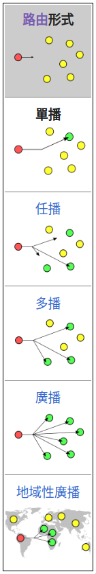

# IP address: 用來識別網絡中的節點
日常生活中的例子: 人的名字, 你想和別人聊天時需要呼叫別人名子, 人家才知道你在和他說話
這個名子的作用等同IP address

## IP address的表示: 32bit的二進制數字
0000 0001 0000 0010 0000 0011 0000 0100
由於以bit的方法表示會太長, 所以會以點分割成四部分然後每部分再轉成10進制:
0000 0001.0000 0010.0000 0011.0000 0100 -> 1.2.3.4

## IP address的分類: 識別方法是查看第一部分的數字 "192".168.1.1
for 一般計算機網絡使用
- A 類: 1 - 127 網+主+主+主
(二進制: 00000000 = 0)
- B 類: 128 - 191 網+網+主+主
(二進制: 10000000 = 128)
- C 類: 192 - 223 網+網+網+主
(二進制: 11000000 = 192)
組播或科研
- D類: 224 - 239 組播
(二進制: 11100000 = 224)
- E類: 240 - 254 拜研
(二進制: 11110000 = 240)
使用二進制來記憶會較好，因為有規律
00000000 = A n+h+h+h
10000000 = B n+n+h+h
11000000 = C n+n+n+h
11100000 = D
11110000 = E

## IP address的組成: 由兩部分組成: 網絡位 + 主機位
192 = C類, 以下是C類Ip address
192.168.1.1 = 192.168.1網絡位, 主機位=1
192.168.1.4 = 192.168.1網絡位, 主機位=4
由於以上網絡位是一樣, 我們稱為相同網絡通信, 以下是跨網絡通訊
192.122.4.25 = 192.122.4網絡位, 主機位=25
192.101.45.27 = 192.101.45網絡位, 主機位=27
跨網絡通訊需要依賴路由(router)
而相同網絡不需要

## Subnet mask: 用來給計算機識別IP address的網絡位和主機位
二進制的1表示網絡位, 0表示主機位, 以下例子
IP address: 192.122.1.2
192是C類, 所以為網+網+網+主 192.122.1=網, 2=主
192.122.1.2 Binary = 1100 0000.0111 1010.0000 0001.0000 0010
所以Subnet mask =    1111 1111.1111 1111.1111 1111.0000 0000 (進行 bitwise and 取得網絡位)
十進制型式 = 255.255.255.0, 這是C類的Subnet mask

## IP address + Subnet mask的表示方法
1. IP address: 192.122.1.2 255.255.255.0
2. IP address: 192.122.1.2/24 (24是Subnet mask 部分: 24表示有24位是網絡位, 24個1, 8個0)

## IP address配置方法:
1. 手動配
2. DHCP自動配, 需要有DHCP server來提供服務

## IP version
ipv4
ipv6

## 傳輸方式
- 單播 unicast  
- 多播 multicast  
- 壙播 broadcast  
  
lazy to type, So here is wiki:  
- https://zh.wikipedia.org/wiki/%E5%96%AE%E6%92%AD  
- https://zh.wikipedia.org/wiki/%E5%A4%9A%E6%92%AD  
- https://zh.wikipedia.org/wiki/%E5%A4%9A%E6%92%AD

## public IP, prviate IP
- public IP: 通俗來說,能直接上internet的IP
- prviate IP: 通俗來說,不能直接上internet的IP,亦稱局域網  
國際規定有一部分IP用於局域網(prviate IP),以下是它們的範圍:
- A類網絡: 10.0.0.0 - 10.255.255.255
- B類網絡: 172.16.0.0 - 172.31.255.255
- C類網絡: 192.168.0.0 - 192.168.255.255

> more information: https://www.twblogs.net/a/5eecf4341e58dca42b879630

## IP network identifier and network broadcast address
IP 主機號能表示的最少數字為network identifier (network ID)  
IP 主機號能表示的最大數字為network broadcast address  
> more information: https://www.techtarget.com/searchnetworking/answer/Can-you-assign-an-IP-address-ending-in-0-or-255
